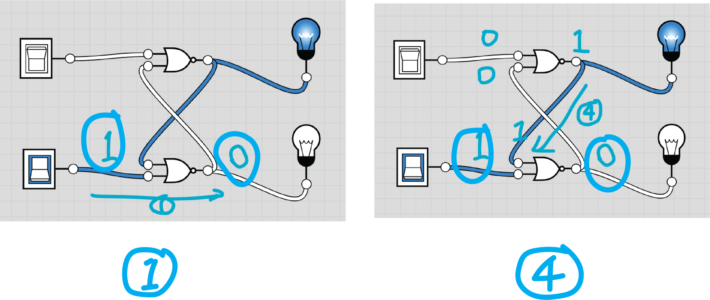
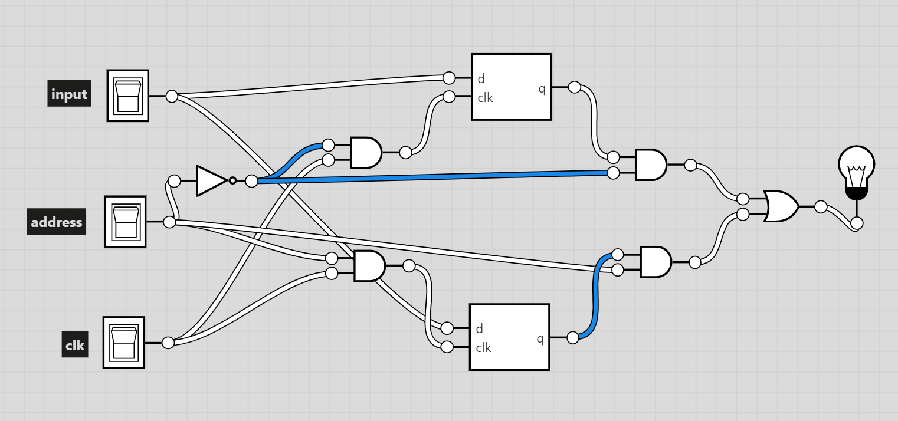

# S R Latch

Last time, we were able to set `1` to be the stored value of our cascading not gates but can't reset it back to `0`. To be able to reset, we can use a new circuit called a Set Reset Latch or S R Latch for short:

Notice that we used two same gates ans weaved the outputs and inputs together into a loop that looks like the number `8`. The gates we used are called `nor` gates which is short for `not or`. It's basically the output of `or` gate inverted.

Let's see the truth table of `nor` gate:

| a | b | a or b | not \(a or b\) / a nor b |
| :--- | :--- | :--- | :--- |
| 0 | 0 | 0 | 1 |
| 0 | 1 | 1 | 0 |
| 1 | 0 | 1 | 0 |
| 1 | 1 | 1 | 0 |

So the `nor` gate outputs `1` if and only if both inputs are `0`. This explains the red wires of our initial state. Since the two `nor` gates are symmetrical, we will just look at the top one:

The switch supplies a `0` but since we don't know the output of the other `nor` gate, the output is undetermined. The same goes with the bottom `nor` gate.

## Set State

Let's see what happens when we turn on the bottom switch:

We see that the top light bulb is on while the bottom is off. Let's see what happened step by step. 

### Step 1

First, we turned on the bottom switch:

Looking at the truth table of `nor` gate, we see that if any one of the inputs is `1`, our output has to be `0`.

| a | b | a nor b |
| :--- | :--- | :--- |
| 0 | 0 | 1 |
| **0** | **1** | **0** |
| **1** | **0** | **0** |
| **1** | **1** | **0** |

### Step 2

The output `0` of the bottom `nor` gate goes to the input of the top `nor` gate.

### Step 3

Since the top switch is off and the output of the bottom `nor` gate is `0`, the output of the top `nor` gate has to be `1` because of our truth table:

| a | b | a nor b |
| :--- | :--- | :--- |
| **0** | **0** | **1** |
| 0 | 1 | 0 |
| 1 | 0 | 0 |
| 1 | 1 | 0 |

### Step 4

The output `1` of the top `nor` gate goes to the input of the bottom `nor` gate. Since both inputs of the bottom `nor` gate is `1`, its output is `0` referencing our truth table:

| a | b | a nor b |
| :--- | :--- | :--- |
| 0 | 0 | 1 |
| 0 | 1 | 0 |
| 1 | 0 | 0 |
| **1** | **1** | **0** |

If we put the state of step 1 and step 4 side by side, we can see that they are the same. So if you continue the tracing, you will simply loop through these 4 steps again and get the same outputs.

## Reset State

Now if we instead turn on the top switch, we will get:

The top light bulb is off while the bottom light bulb is on. The steps are the same as above so we will let you trace through them yourself to get the feel. By now, you may notice that the top and bottom light bulb is always the complement of each other. When one is on, the other must be off. This why we call the top light bulb `q` and the bottom light bulb `q complement`. You should also get that the bottom switch sets `q` to `1` while the top switch resets `q` to `0`. That's why they are called `s` for set and `r` for reset respectively.

## Read State

 What will happen if both switches are off. Let's break it down into two cases. First if the previous state is the reset state and second if it's the set state. Let's look at the reset state:

Again, we will break the analysis down into 4 steps. You should be familiar with the behavior of the `nor` gate by now so we will not bother repeating every detail.

### Step 1

`0 nor 1` is `0`.

### Step 2

Pass down `0` to bottom `nor` gate.

### Step 3

`0 nor 0` is `1`.

### Step 4

Pass `1` up to the top `nor` gate and return back to step 1. You can also start the analysis from the bottom `nor` gate and the result will be the same.

After going through the 4 steps, we see that the output remains the same. Now it's your turn to analys the case when the state is at set state. You should discover that the output also remains the same. This is why we call this state the read state. We simply read what's stored in our latch.

## Not Used State

We now looked at what happens in these three cases:

| r | s | State |
| :--- | :--- | :--- |
| 0 | 0 | Read |
| 0 | 1 | Set |
| 1 | 0 | Reset |

What about when both inputs are `1`?

| r | s | State |
| :--- | :--- | :--- |
| 1 | 1 | ??? |

We will learn why this mysterious state is called Not Used State a bit later. Meanwhile, let's first look at the outputs:

Quite surprisingly, both outputs are `0`. Remember previously we discovered that the two outputs are always complement of each other? This seems to be a violation of our rule! Before we talk more about this state, let's figure out how the outputs are calculated.

### Step 1

`1 nor x` is always `0`.

### Step 2

Pass `0` down to the bottom `nor` gate.

### Step 3

`1 nor 0` is `0`.

### Step 4

Pass `0` up to the top `nor` gate and return back to step 1. You can start the analysis from the bottom `nor` gate and the result will be the same.

## Reading Not Used State

Now what happens when we read this state. In other words, what happens when we set both switches to off and then both to on? Let's do the analysis the usual way and starts at the top `nor` gate.

### Step 1 \(Starting from Top\)

At the start, both inputs are `0` and both outputs from the previous Not Used State are also `0`.

### Step 2 \(Starting from Top\)

### Step 3 \(Starting from Top\)

### Step 4 \(Starting from Top\)

So the outputs tell us that this state behaves the same as the Set State. Well not too fast, let's restart our analysis but this time begin at the bottom `nor` gate.

### Step 1 \(Starting from Bottom\)

At the start, both inputs are `0` and both outputs from the previous Not Used State are also `0`.

### Step 2 \(Starting from Bottom\)

### Step 3 \(Starting from Bottom\)

### Step 4 \(Starting from Bottom\)

Wat? We are confused. If we start the analysis from the bottom `nor` gate instead of the top, we get the same behavior as the Reset State instead of the Set State! So in this case, we say this circuit is in an undertermined state. Since we can already set, reset, and read using the previous three cases, we are good to discard this case and just tell everyone not to use it. That's why it's called the Not Used State.

🎉 You made it! After this long journey, you become an expert in the S R Latch which is the cornerstone of digital storage!

## Additional Resource

Check out Computerphile's real world implementation of the S R Latch:



